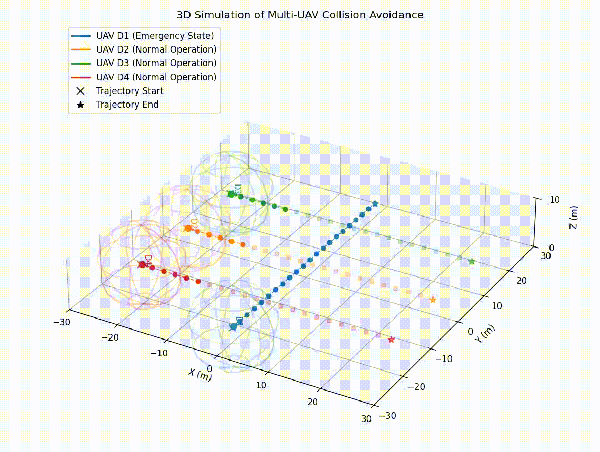
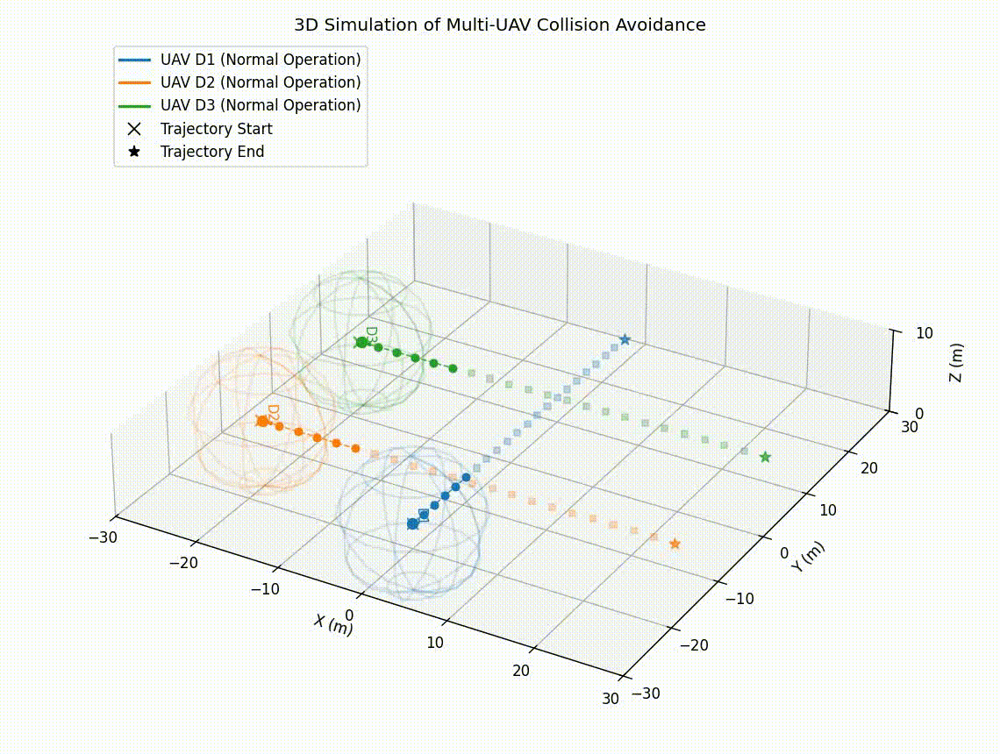
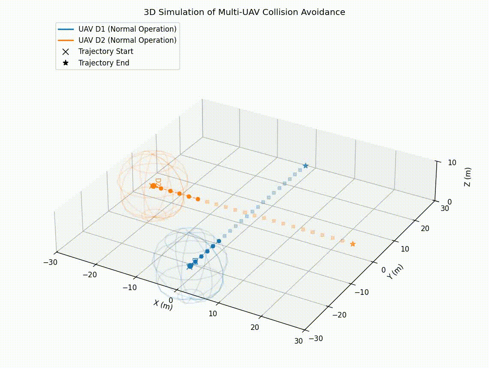
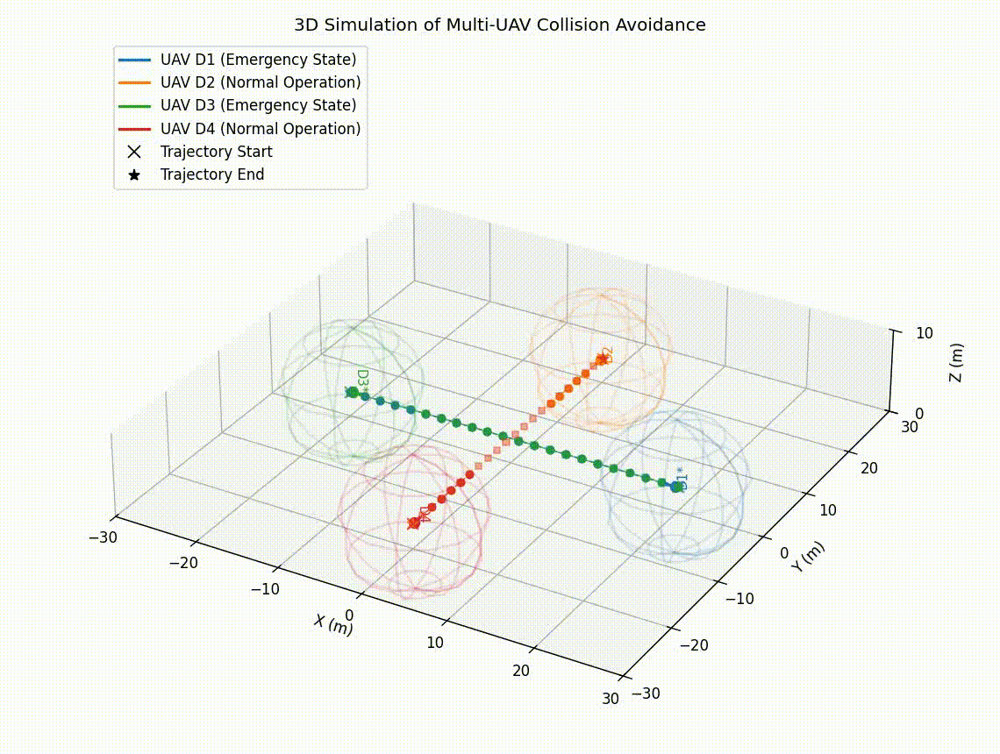
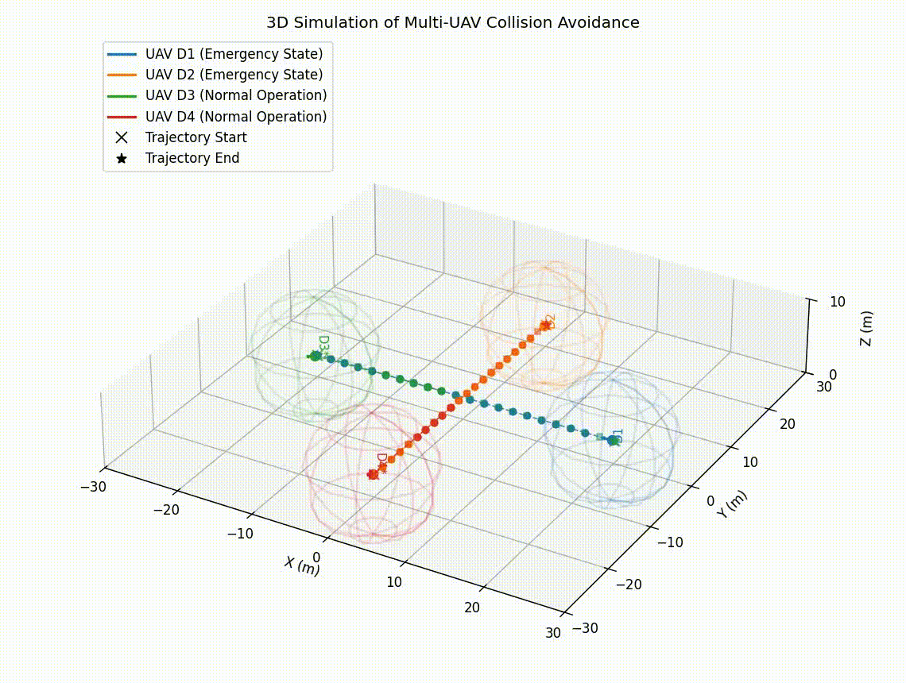
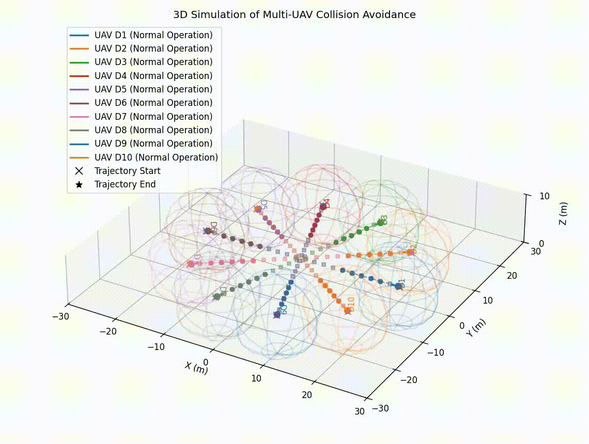
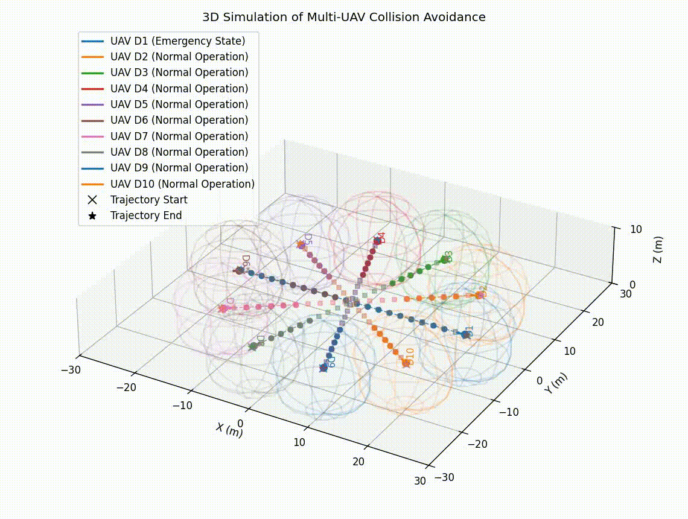
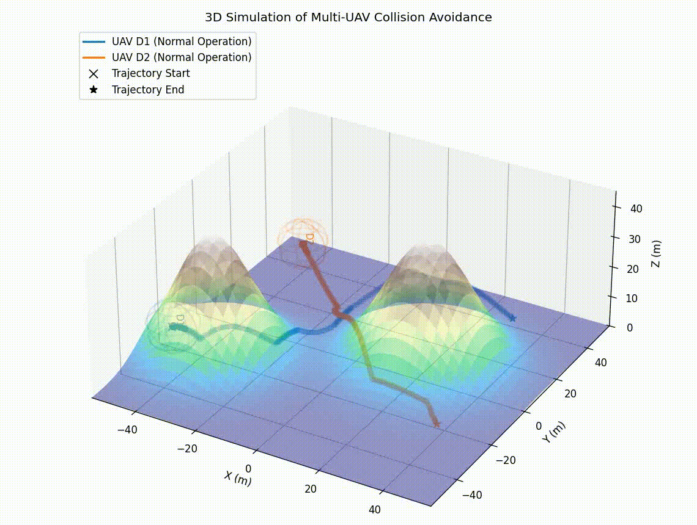
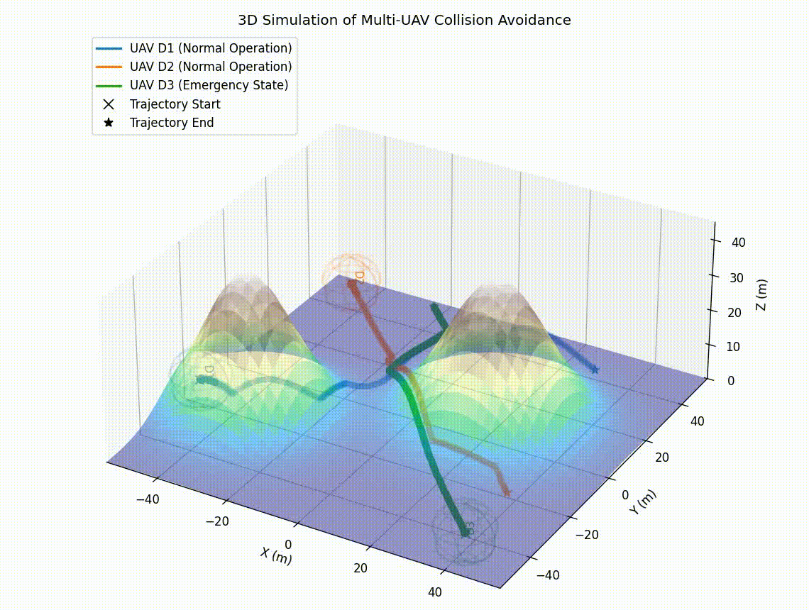

# Decentralized 3D Collision Avoidance for Multi-UAV Systems

This repository provides simulation assets, visual results, and statistical summaries for the paper:

**A Decentralized 3D Collision Avoidance Algorithm for Multi-UAV Systems Based on Modified Artificial Potential Fields**

The proposed method combines global trajectory planning with **A\*** and local reactive navigation with a **modified Artificial Potential Field (APF)**. Each UAV computes its own motion in a decentralized manner using limited shared information from nearby UAVs: current position, operational state, and a window of future waypoints.

The algorithm explicitly handles UAVs in **normal** and **emergency** states. Emergency UAVs receive operational priority, while normal UAVs adapt their trajectories to avoid both the current position and future path of emergency UAVs. The method also uses future-waypoint repulsion, adaptive waypoint visitation, damping, and a random perturbation term to reduce local equilibria and symmetry-induced deadlocks.

---

## Main Features

- Decentralized 3D collision avoidance for multi-UAV systems.
- Global path generation using A\*.
- Local APF-based navigation with modified repulsive terms.
- Emergency-aware interaction rules.
- Predictive avoidance using future waypoint windows.
- Adaptive waypoint visitation during conflicts.
- Statistical evaluation over 100 simulation runs per experiment.
- GIF visualizations for all evaluated scenarios.

---

## Repository Structure

```text
multi-uav-3d-collision-avoidance/
├── images/
│   ├── simulacao_20260421_112348_cenario_1.gif
│   ├── simulacao_20260421_123722_cenario_2.gif
│   ├── simulacao_20260421_150132_cenario_3.gif
│   ├── simulacao_20260421_154631_cenario_4.gif
│   ├── simulacao_20260421_190805_cenario_5.gif
│   ├── simulacao_20260422_082800_cenario_6.gif
│   ├── simulacao_20260422_095325_cenario_7.gif
│   ├── simulacao_20260422_104116_cenario_8.gif
│   ├── simulacao_20260422_115659_cenario_9.gif
│   └── simulacao_20260422_142854_cenario_10.gif
├── resultados_lote/
│   └── statistical results for each experiment
└── README.md
```

---

## Evaluated Scenarios

| Exp. | Scenario | Total UAVs | UAVs considered in trajectory metrics | Success rate | Collision rate |
|---:|---|---:|---:|---:|---:|
| 1 | Static emergency UAV | 4 | 3 | 1.0000 | 0.0000 |
| 2 | Moving emergency UAV | 4 | 4 | 1.0000 | 0.0000 |
| 3 | Predictive avoidance without direct proximity | 3 | 2 | 1.0000 | 0.0000 |
| 4 | Mutual avoidance with future trajectories | 2 | 2 | 1.0000 | 0.0000 |
| 5 | Opposing emergency trajectories | 4 | 4 | 1.0000 | 0.0000 |
| 6 | Perpendicular emergency trajectories | 4 | 4 | 1.0000 | 0.0000 |
| 7 | Scalability test with 10 UAVs | 10 | 10 | 1.0000 | 0.0000 |
| 8 | Large-scale scenario with one emergency UAV | 10 | 10 | 1.0000 | 0.0000 |
| 9 | A\*-based global trajectories over curved terrain | 2 | 2 | 1.0000 | 0.0000 |
| 10 | Emergency UAV with A\*-based global trajectories | 3 | 3 | 1.0000 | 0.0000 |

---

## Experiment GIFs

### Experiment 1 — Static Emergency UAV

A stationary emergency UAV acts as a priority region to be avoided by the normal UAVs.


### Experiment 2 — Moving Emergency UAV

The emergency UAV moves along its priority trajectory while normal UAVs adjust their paths.



### Experiment 3 — Predictive Avoidance Without Direct Proximity

A UAV adjusts its path based on future waypoints shared by another UAV, even before direct proximity occurs.



### Experiment 4 — Mutual Avoidance With Future Trajectories

Two normal UAVs perform mutual avoidance using future trajectory information.



### Experiment 5 — Opposing Emergency Trajectories

Two emergency UAVs move in opposite directions along overlapping trajectories while normal UAVs avoid all agents.



### Experiment 6 — Perpendicular Emergency Trajectories

Emergency UAVs follow perpendicular trajectories while normal UAVs adapt to maintain safe separation.



### Experiment 7 — Scalability Test With 10 UAVs

Ten UAVs operate simultaneously in a symmetric configuration, producing multiple interactions.



### Experiment 8 — Large-Scale Scenario With One Emergency UAV

A large-scale scenario with nine normal UAVs and one emergency UAV evaluates scalability under priority constraints.



### Experiment 9 — A\*-Based Global Trajectories Over Curved Terrain

Two UAVs follow global trajectories generated by A\* over a curved surface while avoiding collision locally.



### Experiment 10 — Emergency UAV With A\*-Based Global Trajectories

Two normal UAVs and one emergency UAV execute A\*-based trajectories over curved terrain.



---

## Statistical Results Over 100 Runs

The table below reports the mean values over 100 simulation runs for each experiment. Distances are given in meters.

| Exp. | Min. inter-UAV distance [m] | Mean lateral error [m] | Mean lateral RMSE [m] | Mean max path deviation [m] | Max path deviation [m] | Mean elongation index |
|---:|---:|---:|---:|---:|---:|---:|
| 1 | 11.4506 | 1.6325 | 2.8732 | 6.9095 | 6.9208 | 1.1749 |
| 2 | 4.1511 | 0.6520 | 1.1931 | 3.2053 | 6.9089 | 1.0702 |
| 3 | 11.2071 | 0.4839 | 0.8032 | 2.1950 | 4.3900 | 1.0426 |
| 4 | 5.6637 | 0.6292 | 1.3417 | 3.8980 | 3.9409 | 1.0734 |
| 5 | 4.2678 | 1.6304 | 2.5093 | 5.7829 | 8.3405 | 1.2113 |
| 6 | 4.5052 | 2.4952 | 3.2534 | 5.9268 | 7.8638 | 1.2891 |
| 7 | 5.1913 | 3.8253 | 5.0376 | 8.7906 | 9.9584 | 1.4921 |
| 8 | 5.2483 | 3.6103 | 4.6416 | 7.8722 | 9.9776 | 1.4482 |
| 9 | 6.0106 | 0.9139 | 1.3414 | 4.4061 | 4.7052 | 1.0487 |
| 10 | 7.7834 | 1.3237 | 2.1212 | 6.0686 | 7.7625 | 1.0720 |

---

## Detailed Statistical Summary

### Experiment 1 — Static Emergency UAV

| Metric | Mean | Std. | Var. | Median | Min. | Max. |
|---|---:|---:|---:|---:|---:|---:|
| Minimum inter-UAV distance [m] | 11.4506 | 0.0166 | 0.000276 | 11.4514 | 11.4093 | 11.4848 |
| Mean lateral error [m] | 1.6325 | 0.0050 | 0.000025 | 1.6324 | 1.6186 | 1.6440 |
| Mean lateral RMSE [m] | 2.8732 | 0.0045 | 0.000021 | 2.8730 | 2.8600 | 2.8837 |
| Mean maximum path deviation [m] | 6.9095 | 0.0082 | 0.000067 | 6.9091 | 6.8893 | 6.9344 |
| Maximum path deviation [m] | 6.9208 | 0.0099 | 0.000098 | 6.9212 | 6.8982 | 6.9419 |
| Mean trajectory elongation index | 1.1749 | 0.0029 | 0.000008 | 1.1750 | 1.1665 | 1.1820 |
| Success rate | 1.0000 | -- | -- | -- | -- | -- |
| Collision rate | 0.0000 | -- | -- | -- | -- | -- |

### Experiment 2 — Moving Emergency UAV

| Metric | Mean | Std. | Var. | Median | Min. | Max. |
|---|---:|---:|---:|---:|---:|---:|
| Minimum inter-UAV distance [m] | 4.1511 | 0.1834 | 0.033637 | 4.1845 | 3.6089 | 4.4408 |
| Mean lateral error [m] | 0.6520 | 0.0144 | 0.000208 | 0.6564 | 0.6006 | 0.6676 |
| Mean lateral RMSE [m] | 1.1931 | 0.0261 | 0.000683 | 1.2012 | 1.0959 | 1.2141 |
| Mean maximum path deviation [m] | 3.2053 | 0.0967 | 0.009351 | 3.2340 | 2.8436 | 3.2621 |
| Maximum path deviation [m] | 6.9089 | 0.0140 | 0.000196 | 6.9079 | 6.8779 | 6.9411 |
| Mean trajectory elongation index | 1.0702 | 0.0015 | 0.000002 | 1.0702 | 1.0673 | 1.0734 |
| Success rate | 1.0000 | -- | -- | -- | -- | -- |
| Collision rate | 0.0000 | -- | -- | -- | -- | -- |

### Experiment 3 — Predictive Avoidance Without Direct Proximity

| Metric | Mean | Std. | Var. | Median | Min. | Max. |
|---|---:|---:|---:|---:|---:|---:|
| Minimum inter-UAV distance [m] | 11.2071 | 0.0075 | 0.000056 | 11.2075 | 11.1910 | 11.2303 |
| Mean lateral error [m] | 0.4839 | 0.0025 | 0.000006 | 0.4835 | 0.4791 | 0.4913 |
| Mean lateral RMSE [m] | 0.8032 | 0.0089 | 0.000080 | 0.8028 | 0.7876 | 0.8251 |
| Mean maximum path deviation [m] | 2.1950 | 0.0469 | 0.002200 | 2.1988 | 2.0759 | 2.2881 |
| Maximum path deviation [m] | 4.3900 | 0.0938 | 0.008801 | 4.3977 | 4.1519 | 4.5761 |
| Mean trajectory elongation index | 1.0426 | 0.0011 | 0.000001 | 1.0426 | 1.0406 | 1.0459 |
| Success rate | 1.0000 | -- | -- | -- | -- | -- |
| Collision rate | 0.0000 | -- | -- | -- | -- | -- |

### Experiment 4 — Mutual Avoidance With Future Trajectories

| Metric | Mean | Std. | Var. | Median | Min. | Max. |
|---|---:|---:|---:|---:|---:|---:|
| Minimum inter-UAV distance [m] | 5.6637 | 0.2441 | 0.059568 | 5.6898 | 5.1603 | 6.2135 |
| Mean lateral error [m] | 0.6292 | 0.0123 | 0.000152 | 0.6269 | 0.6084 | 0.6719 |
| Mean lateral RMSE [m] | 1.3417 | 0.0184 | 0.000338 | 1.3429 | 1.3063 | 1.3922 |
| Mean maximum path deviation [m] | 3.8980 | 0.0299 | 0.000893 | 3.8946 | 3.8213 | 3.9620 |
| Maximum path deviation [m] | 3.9409 | 0.0446 | 0.001991 | 3.9346 | 3.8292 | 4.0735 |
| Mean trajectory elongation index | 1.0734 | 0.0009 | 0.000001 | 1.0733 | 1.0721 | 1.0754 |
| Success rate | 1.0000 | -- | -- | -- | -- | -- |
| Collision rate | 0.0000 | -- | -- | -- | -- | -- |

### Experiment 5 — Opposing Emergency Trajectories

| Metric | Mean | Std. | Var. | Median | Min. | Max. |
|---|---:|---:|---:|---:|---:|---:|
| Minimum inter-UAV distance [m] | 4.2678 | 0.0853 | 0.007278 | 4.2892 | 4.0251 | 4.4005 |
| Mean lateral error [m] | 1.6304 | 0.0654 | 0.004275 | 1.6435 | 1.4615 | 1.7428 |
| Mean lateral RMSE [m] | 2.5093 | 0.0871 | 0.007595 | 2.5127 | 2.3213 | 2.6578 |
| Mean maximum path deviation [m] | 5.7829 | 0.2398 | 0.057517 | 5.8098 | 5.2922 | 6.3378 |
| Maximum path deviation [m] | 8.3405 | 0.6358 | 0.404221 | 8.5955 | 7.1214 | 9.4102 |
| Mean trajectory elongation index | 1.2113 | 0.0333 | 0.001110 | 1.1946 | 1.1783 | 1.3062 |
| Success rate | 1.0000 | -- | -- | -- | -- | -- |
| Collision rate | 0.0000 | -- | -- | -- | -- | -- |

### Experiment 6 — Perpendicular Emergency Trajectories

| Metric | Mean | Std. | Var. | Median | Min. | Max. |
|---|---:|---:|---:|---:|---:|---:|
| Minimum inter-UAV distance [m] | 4.5052 | 0.5110 | 0.261128 | 4.3159 | 4.0209 | 6.0086 |
| Mean lateral error [m] | 2.4952 | 0.1350 | 0.018238 | 2.4768 | 2.2694 | 2.7902 |
| Mean lateral RMSE [m] | 3.2534 | 0.1133 | 0.012827 | 3.2341 | 3.0589 | 3.4952 |
| Mean maximum path deviation [m] | 5.9268 | 0.2310 | 0.053339 | 5.9223 | 5.5922 | 6.4745 |
| Maximum path deviation [m] | 7.8638 | 0.6581 | 0.433043 | 7.8165 | 7.0706 | 9.4881 |
| Mean trajectory elongation index | 1.2891 | 0.0159 | 0.000252 | 1.2851 | 1.2627 | 1.3436 |
| Success rate | 1.0000 | -- | -- | -- | -- | -- |
| Collision rate | 0.0000 | -- | -- | -- | -- | -- |

### Experiment 7 — Scalability Test With 10 UAVs

| Metric | Mean | Std. | Var. | Median | Min. | Max. |
|---|---:|---:|---:|---:|---:|---:|
| Minimum inter-UAV distance [m] | 5.1913 | 0.4187 | 0.175294 | 5.2433 | 4.1408 | 5.8481 |
| Mean lateral error [m] | 3.8253 | 0.2968 | 0.088116 | 3.7515 | 3.3221 | 4.3335 |
| Mean lateral RMSE [m] | 5.0376 | 0.2384 | 0.056853 | 4.9812 | 4.5766 | 5.4050 |
| Mean maximum path deviation [m] | 8.7906 | 0.2261 | 0.051117 | 8.7738 | 8.2205 | 9.1200 |
| Maximum path deviation [m] | 9.9584 | 0.2747 | 0.075441 | 10.0222 | 9.1755 | 10.5202 |
| Mean trajectory elongation index | 1.4921 | 0.0624 | 0.003895 | 1.4872 | 1.3869 | 1.6406 |
| Success rate | 1.0000 | -- | -- | -- | -- | -- |
| Collision rate | 0.0000 | -- | -- | -- | -- | -- |

### Experiment 8 — Large-Scale Scenario With One Emergency UAV

| Metric | Mean | Std. | Var. | Median | Min. | Max. |
|---|---:|---:|---:|---:|---:|---:|
| Minimum inter-UAV distance [m] | 5.2483 | 0.4722 | 0.222938 | 5.3419 | 4.2378 | 5.9782 |
| Mean lateral error [m] | 3.6103 | 0.2437 | 0.059367 | 3.6703 | 3.1122 | 4.0414 |
| Mean lateral RMSE [m] | 4.6416 | 0.1860 | 0.034582 | 4.6936 | 4.2377 | 4.9714 |
| Mean maximum path deviation [m] | 7.8722 | 0.1273 | 0.016215 | 7.9008 | 7.3407 | 8.0674 |
| Maximum path deviation [m] | 9.9776 | 0.3792 | 0.143767 | 9.9410 | 9.1041 | 11.8124 |
| Mean trajectory elongation index | 1.4482 | 0.0619 | 0.003829 | 1.4431 | 1.3555 | 1.7734 |
| Success rate | 1.0000 | -- | -- | -- | -- | -- |
| Collision rate | 0.0000 | -- | -- | -- | -- | -- |

### Experiment 9 — A\*-Based Global Trajectories Over Curved Terrain

| Metric | Mean | Std. | Var. | Median | Min. | Max. |
|---|---:|---:|---:|---:|---:|---:|
| Minimum inter-UAV distance [m] | 6.0106 | 0.0395 | 0.001563 | 6.0054 | 5.9355 | 6.1021 |
| Mean lateral error [m] | 0.9139 | 0.0006 | 0.000000 | 0.9139 | 0.9119 | 0.9153 |
| Mean lateral RMSE [m] | 1.3414 | 0.0014 | 0.000002 | 1.3411 | 1.3383 | 1.3451 |
| Mean maximum path deviation [m] | 4.4061 | 0.0186 | 0.000347 | 4.4070 | 4.3660 | 4.4457 |
| Maximum path deviation [m] | 4.7052 | 0.0332 | 0.001103 | 4.7042 | 4.6452 | 4.7842 |
| Mean trajectory elongation index | 1.0487 | 0.0001 | 0.000000 | 1.0487 | 1.0484 | 1.0490 |
| Success rate | 1.0000 | -- | -- | -- | -- | -- |
| Collision rate | 0.0000 | -- | -- | -- | -- | -- |

### Experiment 10 — Emergency UAV With A\*-Based Global Trajectories

| Metric | Mean | Std. | Var. | Median | Min. | Max. |
|---|---:|---:|---:|---:|---:|---:|
| Minimum inter-UAV distance [m] | 7.7834 | 0.1159 | 0.013444 | 7.7732 | 7.5863 | 7.9420 |
| Mean lateral error [m] | 1.3237 | 0.0031 | 0.000010 | 1.3229 | 1.3181 | 1.3321 |
| Mean lateral RMSE [m] | 2.1212 | 0.0055 | 0.000030 | 2.1217 | 2.1054 | 2.1321 |
| Mean maximum path deviation [m] | 6.0686 | 0.0538 | 0.002895 | 6.0631 | 5.9309 | 6.1839 |
| Maximum path deviation [m] | 7.7625 | 0.0064 | 0.000041 | 7.7631 | 7.7456 | 7.7782 |
| Mean trajectory elongation index | 1.0720 | 0.0017 | 0.000003 | 1.0719 | 1.0683 | 1.0757 |
| Success rate | 1.0000 | -- | -- | -- | -- | -- |
| Collision rate | 0.0000 | -- | -- | -- | -- | -- |

---

## Metrics

- **Minimum inter-UAV distance [m]**: smallest Euclidean distance observed between any pair of UAVs during a simulation.
- **Mean lateral error [m]**: mean distance between executed trajectory points and the planned reference path.
- **Mean lateral RMSE [m]**: mean per-UAV root mean squared lateral deviation from the planned path.
- **Mean maximum path deviation [m]**: average, across UAVs, of the maximum deviation from the planned path.
- **Maximum path deviation [m]**: largest path deviation observed in the simulation.
- **Mean trajectory elongation index**: ratio between executed path length and planned path length, averaged across the UAVs considered in trajectory metrics.
- **Success rate**: fraction of runs in which the simulation completed successfully.
- **Collision rate**: fraction of runs in which the minimum inter-UAV distance fell below the collision threshold.

---

## Notes

- Each experiment was repeated over **100 independent simulation runs**.
- All reported experiments achieved a **100% success rate** and **0% collision rate**.
- The collision threshold used in the simulations was defined as a minimum inter-UAV distance of **1.0 m**.
- Some scenarios exclude stationary or non-evaluated UAVs from trajectory-deviation metrics, while still considering them for inter-UAV distance evaluation when relevant.

---

## Citation

If you use this repository or its simulation assets, please cite the associated paper once published.

```bibtex
@article{luizjunior2026decentralized,
  title={A Decentralized 3D Collision Avoidance Algorithm for Multi-UAV Systems Based on Modified Artificial Potential Fields},
  author={Luiz Junior, F{\'a}bio and others},
  journal={IEEE Access},
  year={2026},
  note={Under review}
}
```

---

## License

Add the appropriate license for your project before public release.
