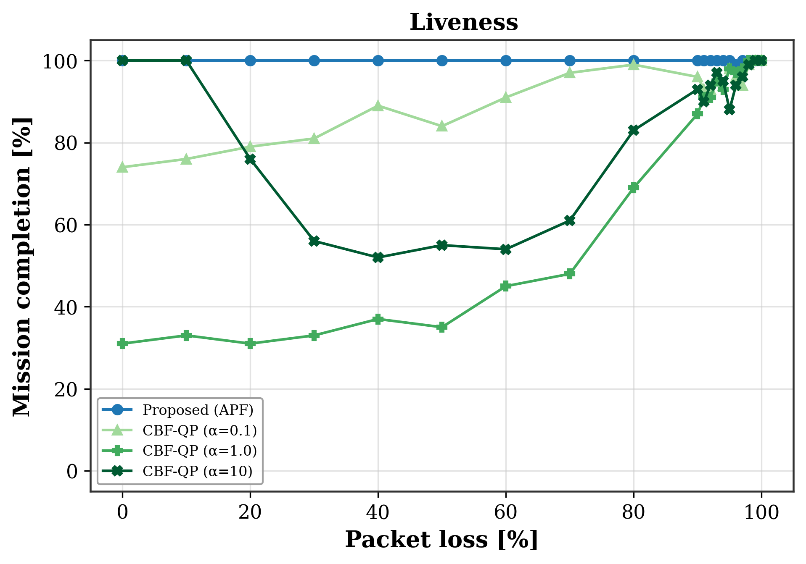
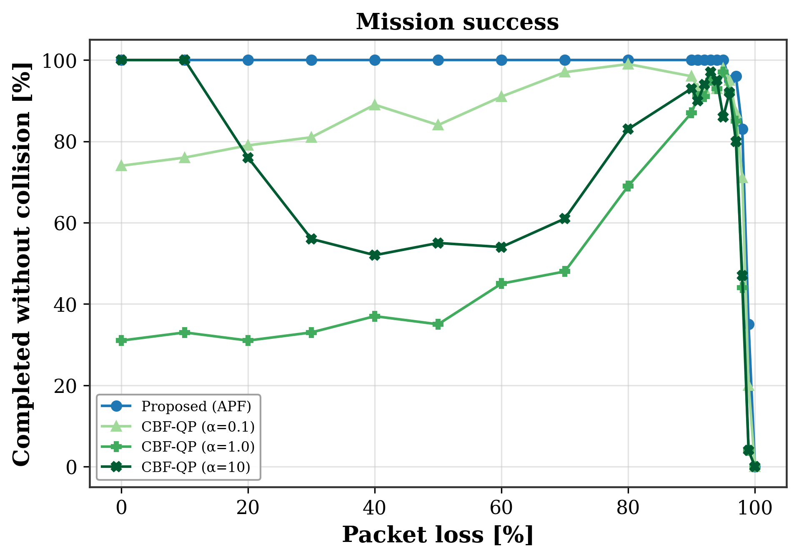
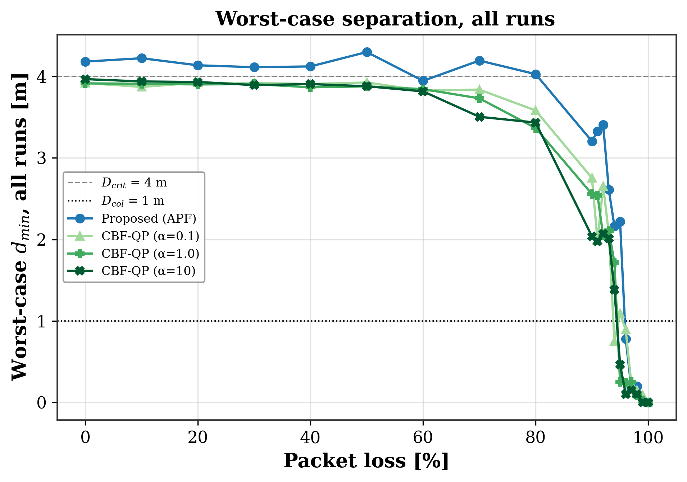
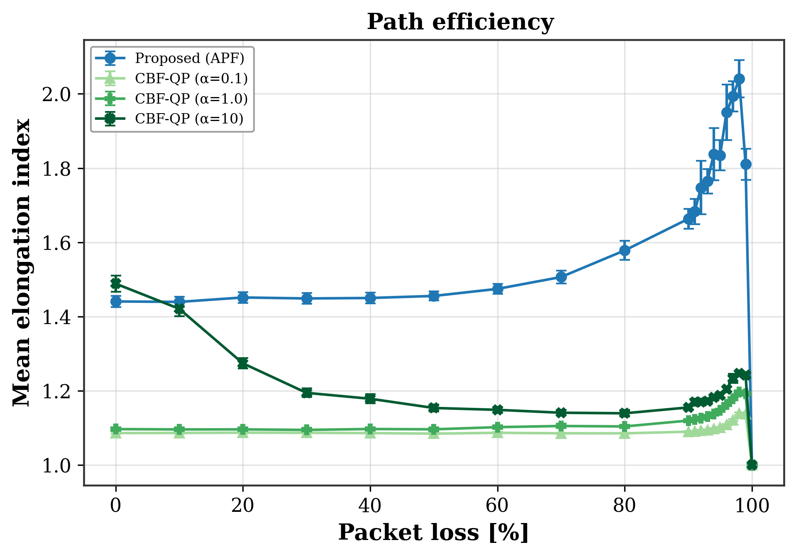
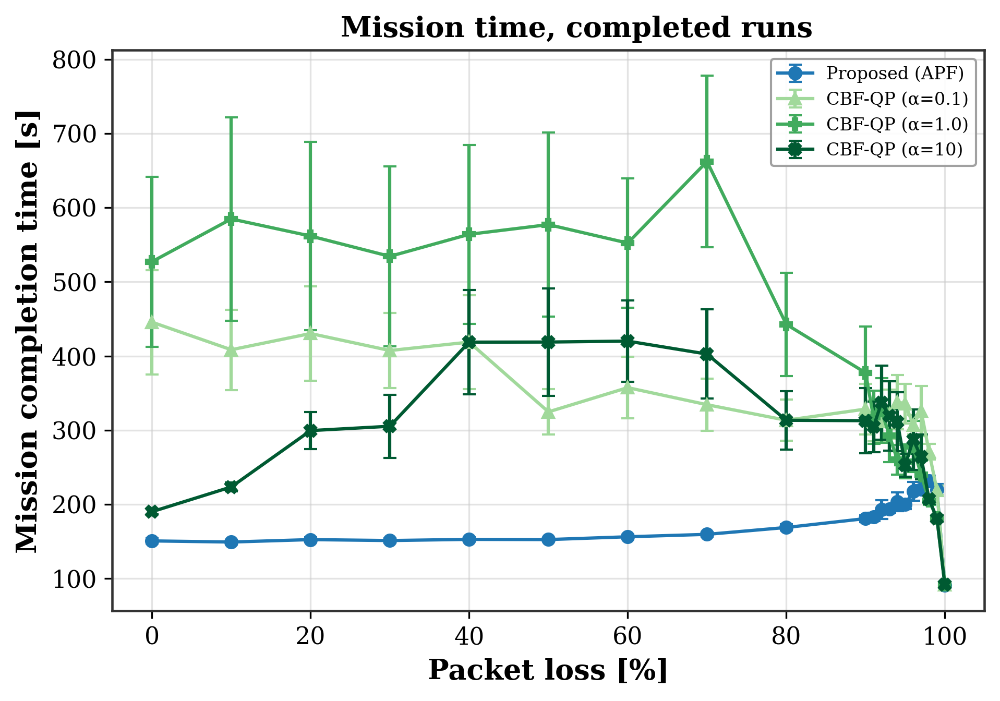

# CBF-QP Baseline — Robustness to Packet Loss (Proposed APF vs. CBF-QP)

## Files in This Folder

| File | Description |
|:---|:---|
| `alpha_cbf_vs_apf.json` | Raw results of the 8000 runs in the batch |
| `20260916_004259_tabela_packet_loss.csv` | Table above in CSV format |
| `analise.txt` | Full text output of the analyzer |
| `20260916_004259_figura_packet_loss_liveness_conclusao.png` | Completion rate |
| `20260916_004259_figura_packet_loss_sucesso_sem_colisao.png` | Collision-free success |
| `20260916_004259_figura_packet_loss_dmin_pior_todas.png` | Worst-case minimum distance |
| `20260916_004259_figura_packet_loss_alongamento_medio.png` | Mean path stretch |
| `20260916_004259_figura_packet_loss_tempo_missao.png` | Mission time |

**Column legend**

`n` runs launched · `nC` runs completed · `Compl%` completion rate · `Wilson CI` 95% confidence interval of the completion rate · `Coll%` runs with a collision · `Viol%` runs with a separation violation · `Succ%` completion without collision · `mean dmin` mean pairwise minimum distance over completed runs · `CI95` half-width of the 95% CI of `mean dmin` · `worst` smallest observed `dmin` · `Stretch` mean path stretch over completed runs · `T miss` mission time over completed runs · `AoI` age of information · `Δdmin` degradation of `dmin` relative to the loss-free condition of the same method · `degr.` degradation class.

## Results — Packet Loss: APF vs. CBF-QP

The CBF-QP baseline is reported for three values of the class-K coefficient: **α = 0.1, 1.0, and 10**.

| loss [%] | Method | n | nC | Compl% | Wilson CI | Coll% | Viol% | Succ% | mean dmin | CI95 | worst | Stretch | T miss | AoI | Δdmin | degr. |
|---:|:---|---:|---:|---:|:---:|---:|---:|---:|---:|---:|---:|---:|---:|---:|---:|:---|
| 0 | Proposed (APF) | 100 | 100 | 100.0 | [96, 100] | 0.0 | 0.0 | 100.0 | 5.013 | 0.060 | 4.182 | 1.441 | 150.7 | 0.00 | 0.000 | none |
| 0 | CBF-QP (α=0.1) | 100 | 74 | 74.0 | [65, 82] | 0.0 | 9.0 | 74.0 | 3.997 | 0.006 | 3.919 | 1.086 | 445.6 | 0.00 | 0.000 | none |
| 0 | CBF-QP (α=1.0) | 100 | 31 | 31.0 | [23, 41] | 0.0 | 5.0 | 31.0 | 3.980 | 0.006 | 3.915 | 1.097 | 527.2 | 0.00 | 0.000 | none |
| 0 | CBF-QP (α=10) | 100 | 100 | 100.0 | [96, 100] | 0.0 | 0.0 | 100.0 | 3.996 | 0.002 | 3.967 | 1.489 | 190.1 | 0.00 | 0.000 | none |
| 10 | Proposed (APF) | 100 | 100 | 100.0 | [96, 100] | 0.0 | 0.0 | 100.0 | 4.998 | 0.065 | 4.223 | 1.439 | 149.2 | 0.02 | 0.015 | none |
| 10 | CBF-QP (α=0.1) | 100 | 76 | 76.0 | [67, 83] | 0.0 | 10.0 | 76.0 | 3.994 | 0.007 | 3.871 | 1.086 | 408.4 | 0.02 | 0.003 | none |
| 10 | CBF-QP (α=1.0) | 100 | 33 | 33.0 | [25, 43] | 0.0 | 4.0 | 33.0 | 3.981 | 0.007 | 3.909 | 1.096 | 584.8 | 0.02 | -0.001 | none |
| 10 | CBF-QP (α=10) | 100 | 100 | 100.0 | [96, 100] | 0.0 | 5.0 | 100.0 | 3.971 | 0.002 | 3.938 | 1.421 | 223.4 | 0.02 | 0.025 | minimal |
| 20 | Proposed (APF) | 100 | 100 | 100.0 | [96, 100] | 0.0 | 0.0 | 100.0 | 4.962 | 0.066 | 4.136 | 1.451 | 152.4 | 0.04 | 0.050 | none |
| 20 | CBF-QP (α=0.1) | 100 | 79 | 79.0 | [70, 86] | 0.0 | 12.0 | 79.0 | 4.000 | 0.006 | 3.923 | 1.087 | 430.3 | 0.04 | -0.003 | none |
| 20 | CBF-QP (α=1.0) | 100 | 31 | 31.0 | [23, 41] | 0.0 | 5.0 | 31.0 | 3.978 | 0.007 | 3.902 | 1.096 | 561.8 | 0.04 | 0.002 | none |
| 20 | CBF-QP (α=10) | 100 | 76 | 76.0 | [67, 83] | 0.0 | 6.0 | 76.0 | 3.971 | 0.003 | 3.932 | 1.274 | 299.4 | 0.04 | 0.026 | minimal |
| 30 | Proposed (APF) | 100 | 100 | 100.0 | [96, 100] | 0.0 | 0.0 | 100.0 | 4.982 | 0.070 | 4.113 | 1.449 | 151.2 | 0.06 | 0.031 | none |
| 30 | CBF-QP (α=0.1) | 100 | 81 | 81.0 | [72, 87] | 0.0 | 7.0 | 81.0 | 4.004 | 0.006 | 3.919 | 1.087 | 407.4 | 0.06 | -0.007 | none |
| 30 | CBF-QP (α=1.0) | 100 | 33 | 33.0 | [25, 43] | 0.0 | 6.0 | 33.0 | 3.979 | 0.006 | 3.906 | 1.095 | 534.4 | 0.06 | 0.001 | none |
| 30 | CBF-QP (α=10) | 100 | 56 | 56.0 | [46, 65] | 0.0 | 12.0 | 56.0 | 3.969 | 0.005 | 3.893 | 1.194 | 305.3 | 0.06 | 0.028 | minimal |
| 40 | Proposed (APF) | 100 | 100 | 100.0 | [96, 100] | 0.0 | 0.0 | 100.0 | 4.917 | 0.066 | 4.122 | 1.450 | 152.8 | 0.10 | 0.096 | minimal |
| 40 | CBF-QP (α=0.1) | 100 | 89 | 89.0 | [81, 94] | 0.0 | 6.0 | 89.0 | 4.001 | 0.006 | 3.907 | 1.086 | 418.7 | 0.10 | -0.004 | none |
| 40 | CBF-QP (α=1.0) | 100 | 37 | 37.0 | [28, 47] | 0.0 | 9.0 | 37.0 | 3.976 | 0.005 | 3.866 | 1.097 | 564.1 | 0.10 | 0.004 | none |
| 40 | CBF-QP (α=10) | 100 | 52 | 52.0 | [42, 62] | 0.0 | 12.0 | 52.0 | 3.965 | 0.005 | 3.906 | 1.179 | 418.7 | 0.10 | 0.032 | minimal |
| 50 | Proposed (APF) | 100 | 100 | 100.0 | [96, 100] | 0.0 | 0.0 | 100.0 | 4.932 | 0.065 | 4.299 | 1.456 | 152.5 | 0.15 | 0.081 | none |
| 50 | CBF-QP (α=0.1) | 100 | 84 | 84.0 | [76, 90] | 0.0 | 8.0 | 84.0 | 4.003 | 0.006 | 3.926 | 1.085 | 324.7 | 0.15 | -0.006 | none |
| 50 | CBF-QP (α=1.0) | 100 | 35 | 35.0 | [26, 45] | 0.0 | 10.0 | 35.0 | 3.975 | 0.004 | 3.878 | 1.096 | 577.2 | 0.15 | 0.005 | none |
| 50 | CBF-QP (α=10) | 100 | 55 | 55.0 | [45, 64] | 0.0 | 17.0 | 55.0 | 3.965 | 0.005 | 3.879 | 1.154 | 418.8 | 0.15 | 0.032 | minimal |
| 60 | Proposed (APF) | 100 | 100 | 100.0 | [96, 100] | 0.0 | 1.0 | 100.0 | 4.860 | 0.063 | 3.946 | 1.475 | 156.3 | 0.22 | 0.153 | relevant |
| 60 | CBF-QP (α=0.1) | 100 | 91 | 91.0 | [84, 95] | 0.0 | 7.0 | 91.0 | 3.999 | 0.007 | 3.825 | 1.087 | 357.4 | 0.22 | -0.002 | none |
| 60 | CBF-QP (α=1.0) | 100 | 45 | 45.0 | [36, 55] | 0.0 | 26.0 | 45.0 | 3.960 | 0.008 | 3.844 | 1.102 | 552.3 | 0.22 | 0.020 | minimal |
| 60 | CBF-QP (α=10) | 100 | 54 | 54.0 | [44, 63] | 0.0 | 33.0 | 54.0 | 3.945 | 0.010 | 3.816 | 1.149 | 420.1 | 0.22 | 0.052 | minimal |
| 70 | Proposed (APF) | 100 | 100 | 100.0 | [96, 100] | 0.0 | 0.0 | 100.0 | 4.857 | 0.059 | 4.195 | 1.506 | 159.5 | 0.35 | 0.156 | relevant |
| 70 | CBF-QP (α=0.1) | 100 | 97 | 97.0 | [92, 99] | 0.0 | 15.0 | 97.0 | 3.992 | 0.009 | 3.838 | 1.085 | 334.4 | 0.35 | 0.005 | none |
| 70 | CBF-QP (α=1.0) | 100 | 48 | 48.0 | [38, 58] | 0.0 | 69.0 | 48.0 | 3.904 | 0.015 | 3.731 | 1.105 | 662.3 | 0.35 | 0.076 | minimal |
| 70 | CBF-QP (α=10) | 100 | 61 | 61.0 | [51, 70] | 0.0 | 72.0 | 61.0 | 3.886 | 0.021 | 3.505 | 1.141 | 402.6 | 0.35 | 0.110 | relevant |
| 80 | Proposed (APF) | 100 | 100 | 100.0 | [96, 100] | 0.0 | 0.0 | 100.0 | 4.761 | 0.067 | 4.028 | 1.578 | 168.8 | 0.60 | 0.252 | relevant |
| 80 | CBF-QP (α=0.1) | 100 | 99 | 99.0 | [95, 100] | 0.0 | 22.0 | 99.0 | 3.969 | 0.016 | 3.582 | 1.085 | 313.4 | 0.60 | 0.029 | minimal |
| 80 | CBF-QP (α=1.0) | 100 | 69 | 69.0 | [59, 77] | 0.0 | 100.0 | 69.0 | 3.791 | 0.021 | 3.367 | 1.104 | 442.7 | 0.60 | 0.189 | relevant |
| 80 | CBF-QP (α=10) | 100 | 83 | 83.0 | [74, 89] | 0.0 | 100.0 | 83.0 | 3.784 | 0.023 | 3.434 | 1.139 | 313.3 | 0.60 | 0.213 | relevant |
| 90 | Proposed (APF) | 100 | 100 | 100.0 | [96, 100] | 0.0 | 3.0 | 100.0 | 4.597 | 0.073 | 3.205 | 1.663 | 180.8 | 1.34 | 0.416 | relevant |
| 90 | CBF-QP (α=0.1) | 100 | 96 | 96.0 | [90, 98] | 0.0 | 75.0 | 96.0 | 3.808 | 0.048 | 2.754 | 1.090 | 328.4 | 1.34 | 0.190 | relevant |
| 90 | CBF-QP (α=1.0) | 100 | 87 | 87.0 | [79, 92] | 0.0 | 100.0 | 87.0 | 3.458 | 0.045 | 2.557 | 1.120 | 377.4 | 1.34 | 0.523 | relevant |
| 90 | CBF-QP (α=10) | 100 | 93 | 93.0 | [86, 97] | 0.0 | 100.0 | 93.0 | 3.408 | 0.063 | 2.039 | 1.155 | 312.8 | 1.34 | 0.589 | relevant |
| 91 | Proposed (APF) | 100 | 100 | 100.0 | [96, 100] | 0.0 | 7.0 | 100.0 | 4.510 | 0.073 | 3.327 | 1.683 | 183.1 | 1.50 | 0.503 | relevant |
| 91 | CBF-QP (α=0.1) | 100 | 93 | 93.0 | [86, 97] | 0.0 | 90.0 | 93.0 | 3.678 | 0.062 | 1.988 | 1.090 | 312.3 | 1.51 | 0.319 | relevant |
| 91 | CBF-QP (α=1.0) | 100 | 91 | 91.0 | [84, 95] | 0.0 | 100.0 | 91.0 | 3.368 | 0.043 | 2.538 | 1.123 | 317.3 | 1.51 | 0.612 | relevant |
| 91 | CBF-QP (α=10) | 100 | 90 | 90.0 | [83, 94] | 0.0 | 100.0 | 90.0 | 3.319 | 0.069 | 1.977 | 1.170 | 304.6 | 1.51 | 0.677 | relevant |
| 92 | Proposed (APF) | 100 | 100 | 100.0 | [96, 100] | 0.0 | 11.0 | 100.0 | 4.428 | 0.069 | 3.408 | 1.747 | 193.1 | 1.71 | 0.584 | relevant |
| 92 | CBF-QP (α=0.1) | 100 | 93 | 93.0 | [86, 97] | 0.0 | 93.0 | 93.0 | 3.668 | 0.060 | 2.654 | 1.093 | 312.1 | 1.71 | 0.329 | relevant |
| 92 | CBF-QP (α=1.0) | 100 | 91 | 91.0 | [84, 95] | 0.0 | 100.0 | 91.0 | 3.223 | 0.065 | 2.045 | 1.126 | 326.4 | 1.71 | 0.757 | relevant |
| 92 | CBF-QP (α=10) | 100 | 94 | 94.0 | [88, 97] | 0.0 | 100.0 | 94.0 | 3.178 | 0.066 | 2.067 | 1.170 | 337.0 | 1.71 | 0.818 | relevant |
| 93 | Proposed (APF) | 100 | 100 | 100.0 | [96, 100] | 0.0 | 21.0 | 100.0 | 4.265 | 0.087 | 2.608 | 1.764 | 193.4 | 1.97 | 0.748 | relevant |
| 93 | CBF-QP (α=0.1) | 100 | 96 | 96.0 | [90, 98] | 0.0 | 99.0 | 96.0 | 3.464 | 0.074 | 2.071 | 1.094 | 321.5 | 1.98 | 0.533 | relevant |
| 93 | CBF-QP (α=1.0) | 100 | 95 | 95.0 | [89, 98] | 0.0 | 100.0 | 95.0 | 3.155 | 0.063 | 2.107 | 1.131 | 293.0 | 1.97 | 0.825 | relevant |
| 93 | CBF-QP (α=10) | 100 | 97 | 97.0 | [92, 99] | 0.0 | 100.0 | 97.0 | 3.050 | 0.073 | 2.012 | 1.172 | 319.3 | 1.98 | 0.947 | relevant |
| 94 | Proposed (APF) | 100 | 100 | 100.0 | [96, 100] | 0.0 | 30.0 | 100.0 | 4.170 | 0.103 | 2.162 | 1.837 | 203.4 | 2.32 | 0.843 | relevant |
| 94 | CBF-QP (α=0.1) | 100 | 94 | 94.0 | [88, 97] | 1.0 | 100.0 | 93.0 | 3.130 | 0.123 | 0.747 | 1.098 | 338.1 | 2.33 | 0.867 | relevant |
| 94 | CBF-QP (α=1.0) | 100 | 93 | 93.0 | [86, 97] | 0.0 | 100.0 | 93.0 | 2.833 | 0.087 | 1.716 | 1.138 | 260.2 | 2.33 | 1.147 | relevant |
| 94 | CBF-QP (α=10) | 100 | 95 | 95.0 | [89, 98] | 0.0 | 100.0 | 95.0 | 2.827 | 0.082 | 1.382 | 1.182 | 311.3 | 2.33 | 1.169 | relevant |
| 95 | Proposed (APF) | 100 | 100 | 100.0 | [96, 100] | 0.0 | 40.0 | 100.0 | 3.971 | 0.103 | 2.218 | 1.835 | 199.8 | 2.80 | 1.042 | relevant |
| 95 | CBF-QP (α=0.1) | 100 | 98 | 98.0 | [93, 99] | 0.0 | 100.0 | 98.0 | 2.971 | 0.102 | 1.092 | 1.101 | 335.6 | 2.82 | 1.026 | relevant |
| 95 | CBF-QP (α=1.0) | 100 | 98 | 98.0 | [93, 99] | 1.0 | 100.0 | 97.0 | 2.516 | 0.109 | 0.249 | 1.147 | 257.7 | 2.81 | 1.464 | relevant |
| 95 | CBF-QP (α=10) | 100 | 88 | 88.0 | [80, 93] | 3.0 | 100.0 | 86.0 | 2.567 | 0.117 | 0.464 | 1.188 | 252.7 | 2.82 | 1.429 | relevant |
| 96 | Proposed (APF) | 100 | 99 | 99.0 | [95, 100] | 4.0 | 74.0 | 95.0 | 3.396 | 0.160 | 0.781 | 1.950 | 217.6 | 3.53 | 1.617 | relevant |
| 96 | CBF-QP (α=0.1) | 100 | 96 | 96.0 | [90, 98] | 1.0 | 100.0 | 95.0 | 2.479 | 0.120 | 0.892 | 1.109 | 306.9 | 3.55 | 1.519 | relevant |
| 96 | CBF-QP (α=1.0) | 100 | 97 | 97.0 | [92, 99] | 6.0 | 100.0 | 92.0 | 2.168 | 0.123 | 0.241 | 1.163 | 277.9 | 3.53 | 1.812 | relevant |
| 96 | CBF-QP (α=10) | 100 | 94 | 94.0 | [88, 97] | 2.0 | 100.0 | 92.0 | 2.234 | 0.120 | 0.104 | 1.204 | 287.3 | 3.54 | 1.762 | relevant |
| 97 | Proposed (APF) | 100 | 100 | 100.0 | [96, 100] | 4.0 | 93.0 | 96.0 | 2.735 | 0.179 | 0.177 | 1.993 | 220.3 | 4.73 | 2.278 | relevant |
| 97 | CBF-QP (α=0.1) | 100 | 94 | 94.0 | [88, 97] | 7.0 | 100.0 | 87.0 | 1.905 | 0.136 | 0.235 | 1.121 | 326.1 | 4.77 | 2.092 | relevant |
| 97 | CBF-QP (α=1.0) | 100 | 98 | 98.0 | [93, 99] | 13.0 | 100.0 | 85.0 | 1.670 | 0.123 | 0.251 | 1.178 | 239.7 | 4.73 | 2.310 | relevant |
| 97 | CBF-QP (α=10) | 100 | 96 | 96.0 | [90, 98] | 16.0 | 100.0 | 80.0 | 1.623 | 0.125 | 0.149 | 1.233 | 263.9 | 4.74 | 2.374 | relevant |
| 98 | Proposed (APF) | 100 | 100 | 100.0 | [96, 100] | 17.0 | 100.0 | 83.0 | 1.929 | 0.188 | 0.199 | 2.041 | 231.7 | 7.07 | 3.084 | relevant |
| 98 | CBF-QP (α=0.1) | 100 | 99 | 99.0 | [95, 100] | 28.0 | 100.0 | 71.0 | 1.376 | 0.110 | 0.152 | 1.138 | 271.1 | 7.12 | 2.621 | relevant |
| 98 | CBF-QP (α=1.0) | 100 | 100 | 100.0 | [96, 100] | 56.0 | 100.0 | 44.0 | 0.970 | 0.106 | 0.082 | 1.197 | 205.2 | 7.04 | 3.011 | relevant |
| 98 | CBF-QP (α=10) | 100 | 99 | 99.0 | [95, 100] | 52.0 | 100.0 | 47.0 | 0.994 | 0.101 | 0.102 | 1.247 | 207.1 | 7.05 | 3.002 | relevant |
| 99 | Proposed (APF) | 100 | 100 | 100.0 | [96, 100] | 65.0 | 100.0 | 35.0 | 0.841 | 0.112 | 0.033 | 1.810 | 219.9 | 13.69 | 4.171 | relevant |
| 99 | CBF-QP (α=0.1) | 100 | 100 | 100.0 | [96, 100] | 80.0 | 100.0 | 20.0 | 0.725 | 0.070 | 0.087 | 1.137 | 218.8 | 13.70 | 3.273 | relevant |
| 99 | CBF-QP (α=1.0) | 100 | 100 | 100.0 | [96, 100] | 96.0 | 100.0 | 4.0 | 0.435 | 0.060 | 0.018 | 1.192 | 181.5 | 13.41 | 3.545 | relevant |
| 99 | CBF-QP (α=10) | 100 | 100 | 100.0 | [96, 100] | 96.0 | 100.0 | 4.0 | 0.436 | 0.050 | 0.001 | 1.242 | 180.9 | 13.41 | 3.560 | relevant |
| 100 | Proposed (APF) | 100 | 100 | 100.0 | [96, 100] | 100.0 | 100.0 | 0.0 | 0.000 | 0.000 | 0.000 | 1.000 | 90.9 | — | 5.013 | relevant |
| 100 | CBF-QP (α=0.1) | 100 | 100 | 100.0 | [96, 100] | 100.0 | 100.0 | 0.0 | 0.007 | 0.001 | 0.002 | 1.000 | 91.4 | — | 3.990 | relevant |
| 100 | CBF-QP (α=1.0) | 100 | 100 | 100.0 | [96, 100] | 100.0 | 100.0 | 0.0 | 0.007 | 0.001 | 0.002 | 1.000 | 91.4 | — | 3.973 | relevant |
| 100 | CBF-QP (α=10) | 100 | 100 | 100.0 | [96, 100] | 100.0 | 100.0 | 0.0 | 0.007 | 0.001 | 0.002 | 1.000 | 91.4 | — | 3.989 | relevant |

## Figures

### Completion rate (liveness)

### Collision-free success

### Worst-case minimum distance (all runs)

### Mean path stretch

### Mission time

